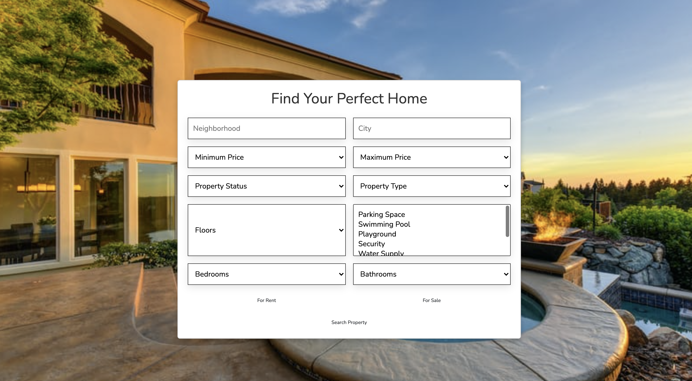

# KIJIJI
#### KIJIJI Real Estate Web Application, 19/01/2022
#### By Veronica Muriithi, Allan Gikonyo, Michael Osinde, Kelvin Munyao and Zakiya Adam
## Description
The following code represents the web application of Kijiji, a Nairobi based real estate company that connect potential real estate buyers with sellers. The web application not only serves as a medium to widen the company's customer base but also allows customers to survey different houses online. 

 The following is the demo user interface of the landing page. 

 

## Setup/Installation Requirements
The landing page has no setup/ installation requirements needed. The landing page can be accessed via any browser. The code is also independent of any app. 

## Known Bugs
None. 

## Technologies Used
HTML, CSS (Bootstrap5),  Javascript(JQuery)
## Support and contact details
If you run into any issues or have questions, ideas or concerns contact kijiji@info.com or make a contribution to the code.
### License
MIT 
Copyright (c) 2022
